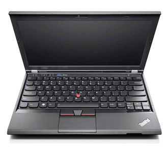

ThinkPad is one of the first options for many geeks, students and Linux
users. It is the standard option available in Lenovo's X Series under
12-13 inches display category.

<figure>
<figcaption>ThinkPad X230</figcaption>
</figure>

### Hardware

Below is the short list for this setup. *After-market SSDs were bought*
because Lenovo is charging a lot for these.

#### Tested Configuration

| Feature                                | Configuration                                                                               |
|----------------------------------------|---------------------------------------------------------------------------------------------|
| System                                 | X230 23257MG                                                                                |
| CPU                                    | Intel Core i5-3320M (2.60 GHz, 3MB L3, 1600MHz FSB)                                         |
| Graphics                               | Intel HD Graphics 4000                                                                      |
| RAM                                    | 1x4GB PC3-10600 DDR3 memory at 1600MHz (Hynix)                                              |
| Display                                | 12.5" IPS TFT display HD LED                                                                |
| Disk (2.5" × 7mm hdd bay)              | HGST HTS725050A7E630 500GB/7200rpm                                                          |
| MiniPCI Express slot (m)SATA2)         | TOSHIBA THNSNH128GMCT 128GB                                                                 |
| Ethernet                               | Intel Gigabit 82579LM                                                                       |
| Wireless                               | 2x2 Intel Centrino Advanced-N 6205 AGN                                                      |
| Bluetooth                              | Broadcom BCM20702 Bluetooth 4.0                                                             |
| ExpressCard/54 slot                    | Yes                                                                                         |
| SD Card slot                           | Yes                                                                                         |
| Mini DisplayPort                       | Yes                                                                                         |
| VGA port                               | Yes                                                                                         |
| USB 3.0                                | Two on the left                                                                             |
| USB 2.0                                | One on the right powered (BIOS-selectable: on even when system off, on when suspended, off) |
| Webcam                                 | 720p HD Integrated camera                                                                   |
| Stereo digital microphones             | Yes                                                                                         |
| Stereo speakers                        | Yes                                                                                         |
| Combined headphone and microphone jack | Yes                                                                                         |
| UltraNav                               | Trackpoint and Buttonless Touchpad                                                          |
| Keyboard                               | Backlit + ThinkLight (Portuguese Layout)                                                    |
| Integrated Fingerprint Reader          | Yes                                                                                         |
| Built-in Battery                       | 6 Cell                                                                                      |
| Power                                  | 65W AC Adapter                                                                              |
| Docking Port                           | Supports ThinkPad UltraBase Series 3, ThinkPad Mini Dock Series 3, etc.                     |

#### Compatibility

Everything works out-of-the-box except the integrated fingerprint
scanner. To enable it you need to install some extra packages:

Just make sure you press ESC and login with your password when you boot
the computer if you want your login keyring to be unlocked.

### System Configuration

#### Kernel

The following enables the new P-state Intel CPU scheduler and some power
saving options.

The following forces some power saving options for the Intel graphics
cards.

#### TrackPoint

You can change the default speed and sensitivity of the TrackPoint.

#### PulseAudio

Automatically switch to Bluetooth or USB headset by adding the
following:

#### SSD

'''If you are using Ubuntu 14.04 you can skip these steps since it
already runs periodically. '''

If you are using an SSD enable TRIM to always get the best performance.
Just add to the mount options. The option avoids some writes on the SSD
which is also desirable.

If you use LVM you have to also change a line in the LVM configuration
file.

#### Intel Rapid Start Technology

The Intel chipset supports Intel Rapid Start, a technology that allows
the laptop to go into a deeper sleep ACPI S4 (hibernate) from ACPI S3
(standby) after some period of time.

This type of hibernation is directly supported in the hardware, so you
will not see any traditional OS boot sequences during wake up from a
hibernated machine as before.

To setup Intel Rapid Start you need:

`* an SSD`  
`* a BIOS that supports Intel Rapid Start Technology`  
`* a partition (primary/logical) >= than the laptop's physical memory`

Then you must give the partition a specific id as to be recognized by
the hardware. According to Intel, it must be:

`* in fdisk, id: 84, or`  
`* in gdisk, guid: D3BFE2DE-3DAF-11DF-BA40-E3A556D89593`

#### Bluetooth

Problem: A number of Bluetooth profiles won't work until the firmware is
loaded.

Download this  and put it at
(all lowercase)

#### Zram/Compcache

If you are low on memory you can always compress your data in RAM.

Just issue and check if it works with
