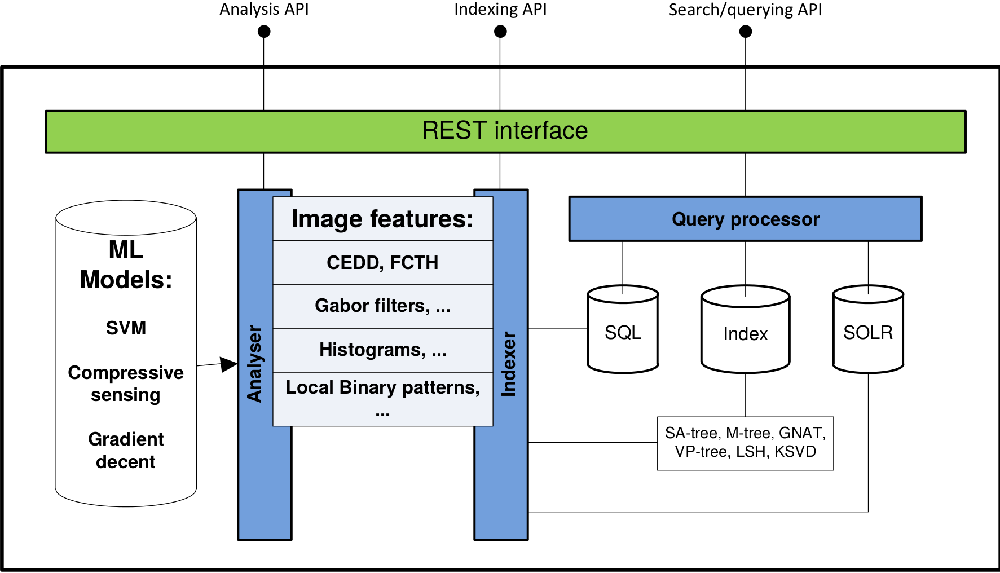

<figure>
<figcaption>Framework diagram</figcaption>
</figure>

Overview
--------

**NovaSearchServices** is a set of APIs that allows the creation of
applications that feature extraction for images and text, indexing and
retrieval.

Build on top of the best available image processing, classification and
retrieval libraries, It was designed for speed (programmed in C++) and
easy of use for rapid prototyping using state-of-the-art image
processing, indexing and machine learning algorithms

The repo for the framework is available
[here](https://bitbucket.org/a_mourao/searchservices) (request access to
André Mourão).

Details for the framework components:
-------------------------------------

### Core

#### Analyser

Using a factory paradigm and common interfaces, the framework enables
simple interchanging of components. These features make testing multiple
combinations of techniques painless and allow rapid prototyping and the
creation of perfect solutions for a wide range of CBMI and
classification tasks and challenges.

''' Available algorithms '''

Feature extractors:

-   Global image features (nVector/FeatureExtractor.h)
    -   Gabor: [gaborExtractor](/wiki/GaborExtractor "wikilink")
    -   GIST: [gistExtractor](/wiki/GISTExtractor "wikilink")
    -   LBP: [lbpExtractor](/wiki/LBPExtractor "wikilink")
    -   HSV histograms:
        [hsvHistogramExtractor](/wiki/HistogramExtractor "wikilink")
    -   CEDD: [lireExtractor](/wiki/LireExtrator "wikilink")
    -   FCTH: [lireExtractor](/wiki/LireExtrator "wikilink")
    -   Eigen extractor: [eigenAnalyser](/wiki/EigenExtractor "wikilink")
-   Keypoint based (nKeypoint/KeypointFeatureExtractor.h)
    -   SIFT: [sift](/wiki/SIFTExtractor "wikilink")
    -   SURF: [surf](/wiki/SURFExtractor "wikilink")

Object detectors (nRoi/RoiFeatureExtractor.h):

-   Face detection: [faceDetection](/wiki/FaceDetection "wikilink")
-   Person detection: [haarDetector](/wiki/HaarDetector "wikilink")
-   Car detection: [haarDetector](/wiki/HaarDetector "wikilink")
-   Generic Haar-based object detector:
    [haarDetector](/wiki/HaarDetector "wikilink")

Classifiers (nTag/IClassifier.h):

-   Sparse approximation
-   SVM
-   Vowpal Wabbit
-   kNN

#### Indexing

The indexers follow the same interchangeability model. Available
implementations allow balancing speed and accuracy to answer any task
requirements.

Indexers:

-   Sparse approximation
-   MSIDX
-   E2LSH
-   Spherical Hashing
-   Linear
-   kd and kMeans tree

#### Endpoints

NSS runs as a service that communicates using REST endpoints Developers
can hand-craft solution to the retrieval or classification tasks, or use
our generic classifier or indexer that leverage on the
interchangeability properties of the framework.

### Extra

#### Multimodal retrieval support

The framework supports retrieval from independent indexes that
communicate through REST and output JSON in a simple standard format.
The results are combined using a Federator, a Django-based application
that makes the requests to the indexes, combines and outputs the final
rank. It is available [here](https://bitbucket.org/a_mourao/federator)
(request access to André Mourão).

#### External feature extractors

The framework supports feature extractors from "outside" programs
through REST and output JSON in a simple standard format.

Setup
-----

### Dependencies:

-   HDF5
-   Flann

<!-- -->

-   OpenCV 2.4.9
-   FFTW 3
-   Armadillo
-   lapack
-   blas

<!-- -->

-   Poco
-   libcurl
-   pugixml
-   jsoncpp

#### Getting the dependencies:

64 bit versions of these libraries are **available at Ariadne** under
`/localstore/searchservices/`.

The easiest way to **run framework in local computer** is to:

-   get code from [git](https://bitbucket.org/a_mourao/searchservices)
-   copy libraries to the same folder on local computer
-   build using the provided Makefile

**Tested on Ubuntu 13.10/14.04**

**Atention:** there are additional dependencies (e.g. libav), available
on the default Ubuntu PPA. On **14.10**, the required **libav** version
is **not available** on the repo and needs to be installed/downloaded
**manually**.

Instructions to build libs manually is available
[here](/wiki/Build_dependencies_from_source_for_NovaSearchServices "wikilink").

### Building:

The project is being developed using
[Codeblocks](http://www.codeblocks.org/). For convenience, developers
can also generate a Makefile with all possible targets using
[cbp2make](http://sourceforge.net/projects/cbp2make/) (also available on
the Ubuntu Repo)

`cbp2make -in searchservices.cbp -out Makefile`

Before compiling and running, you may need to add the following
libraries folders to the env. vars. Simple example:

`export LD_LIBRARY_PATH=/localstore/searchservices/libs/lib:$LD_LIBRARY_PATH && export LIBRARY_PATH=/localstore/searchservices/libs/bin:$LIBRARY_PATH && export C_INCLUDE_PATH=/localstore/searchservices/libs/include:$C_INCLUDE_PATH && export CPLUS_INCLUDE_PATH=/localstore/searchservices/libs/include:$CPLUS_INCLUDE_PATH && export LD_LIBRARY_PATH=/usr/lib/jvm/java-7-oracle/:$LD_LIBRARY_PATH && export LD_LIBRARY_PATH=/usr/lib/jvm/java-7-oracle/jre/lib/amd64/server/:$LD_LIBRARY_PATH`

#### Build with Makefile:

Simply run `make` on the project root folder Binaries will be deployed
in `bin/Release` and `bin/Debug`

### Running:

There are 2 main ways to execute code on the framework:

#### Server:

The server runs a REST service that receives requests on a set of
configurable endpoints.

`./bin/Release/server <config.json>`

The JSON file sets what endpoints to run and their parameters.

#### Other:

In addition to the server, there are two targets for batch execution and
testing. The main methods are the following:

-   `./bin/Release/runAnalyser`: analyser/Main2.cpp
-   `./bin/Release/runindexer`: analyser/Main3.cpp
